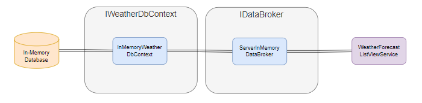

# Organizing Your Data Pipeline in Blazor

AKA - Get your data out your Components.

The route cause of many Blazor questions asked on StackOverflow and other forums is data pipeline design.  Specifically, retrieving, managing and interacting with data in the UI.   

A typical question goes like this: How do I wire up components B and C to the data in A?  How does B tell A to update the data, and how do you tell C that the data has been updated?  Or I've created the necessary wiring for the above, plastered `StateHasChanged` all over the place and still can't make it work.

Two way binding is great, but it's much overused and abused!

The solution is simple: get the data out of the UI.  It belongs in services with events to notify whomever wants to know when things change.

In this article I demonstrate how to build a data pipeline for the `FetchData` page of the standard Blazor Template.  Specifically I:

1. Demonstrate a simple separation of code into projects to enforce a clean design principles.
2. Build an in-memory EF database.
2. Demonstrate how to set up the DbContext Factory and use "unit of work" Db contexts.
3. Demonstrate how to use interfaces to decouple core application code from the data domain code.
4. Demonstrate how to build DI [Dependanct Injection] services.
5. Implement an event driven service pattern to drive component updates.  

## Implementation Comments

### Nullable

`Nullable` is enabled.  It's tempting as a relative beginner to turn it off and get rid of all those warnings you keep getting.  DON'T.  Learn to code with Nullable enabled, it may take a bit of getting used to, but your code will be cleaner and many, many of those `if(x != null)` go way.

### Clean Design

The solution is split into several projects to promote clean design and enforce dependancy separation.  Core, Data and UI are the primary domains.  I've included the namespace in the code blocks so you can see which domain each class belongs to.

### Interfaces and Dependency Injection

The solution uses interfaces extensively to abstract dependencies, and the DI container to manage class instances.  In general it's a good idea to classify your objects into one of four types:

1. DI Services.
2. Components.
3. Data Classes.
4. Utilities - normally implemented as static classes.

### Application Design


## Data Class

Base database classes should represent the data retrieved from and submitted to the database.  Data classes are used throughout the application so are *core domain* objects.

The application uses the original `WeatherForecast` class with the following changes:

1. Changed to a `Record`.
2. Added Id field.
3. Remove the `TemperatureF` property.  It's only for display purposes, so we can add it as a class extension.

```csharp
namespace Blazr.App.Core;

public record WeatherForecast
{
    [Key] public Guid WeatherForecastId { get; init; }
    public DateTime Date { get; init; }
    public int TemperatureC { get; init; }
    public string? Summary { get; init; }
}
```

Why use a `record`?  How do you edit a `WeatherForecast`?

Data read from the database should be immutable.  You should never modify the dataset that you've read.  Using records makes record equality checks simple.  To edit a record, create an edit object.  Read the record to populate the object, and create a new record to save it back to the database.  Use the edit class to monitor edit state and validate data.

## Blazor Server Demo Data Pipline Classes



## The DbContext

The application uses Entity Framework as it's ORM [Object Request Mapper] - a fancy term for the system that does all the hard work in accessing a database.  To keep things simple it uses an in-memory implementation that loads a set of test data when the apllication starts.

In async environments it's likely that more that one process will access the database at any one time.  The classic single shared db context no longer works.  The solution is to use a Db context factory and apply unit of work principles: normally a context per method instance.

The final DI service setup in `Program` in the Web project looks like this:

```csharp
builder.Services.AddDbContextFactory<InMemoryWeatherDbContext>(options => options.UseInMemoryDatabase("WeatherDatabase"));
```

### IWeatherDbContext

First an interface to abstract the DbContext.  Note that it's necessary to expose any underlying `DbContext` methods that are used by the Data Broker.

1. A DBSet property for the WeatherForecast collection.
2. The `Set` method of underlying `DbConbtext`. 

```csharp
namespace Blazr.App.Data;

public interface IWeatherDbContext
{
    public DbSet<WeatherForecast> WeatherForecast { get; set; }
    public DbSet<TEntity> Set<TEntity>() where TEntity : class;
}
```

### InMemoryWeatherDbContext

This is the In-Memory Implementation.  It inherits from `DbContext` and implements `IWeatherDbContext`.  `OnModelCreating` isn't strictly necessary here, but I've included it to demonstrate how to map `DbContext` entities to database objects.

```csharp
namespace Blazr.App.Data;

public class InMemoryWeatherDbContext 
    : DbContext, IWeatherDbContext
{
    public DbSet<WeatherForecast> WeatherForecast { get; set; } = default!;

    public InMemoryWeatherDbContext(DbContextOptions<InMemoryWeatherDbContext> options) : base(options) { }

    protected override void OnModelCreating(ModelBuilder modelBuilder)
        => modelBuilder.Entity<WeatherForecast>().ToTable("WeatherForecast");
}
```

## Test Data

`TestWeatherDataBuilder` is based on the *Singleton Pattern* (not to be confused with Singleton Service) class.  It maintains a single instance of the class accessed through the static `GetInstance()` method.  There's a single public method - `LoadDbContext` - to load the test data into the supplied `InMemoryWeatherDbContext`.

```csharp
namespace Blazr.App.Data;

public class TestWeatherDataBuilder
{
    private bool _initialized = false;
    private int RecordsToGenerate = 50;
    private readonly string[] Summaries = new[]
    {
    "Freezing", "Bracing", "Chilly", "Cool", "Mild", "Warm", "Balmy", "Hot", "Sweltering", "Scorching"
    };

    public IEnumerable<WeatherForecast> WeatherForecasts { get; private set; } = new List<WeatherForecast>();

    private TestWeatherDataBuilder()
    {
        if (!_initialized)
        {
            WeatherForecasts = this.GetForecasts();
            _initialized = true;
        }
    }

    public void LoadDbContext(IDbContextFactory<InMemoryWeatherDbContext> factory)
    {
        using var dbContext = factory.CreateDbContext();

        if (dbContext.WeatherForecast.Count() == 0)
        {
            dbContext.AddRange(this.WeatherForecasts);
            dbContext.SaveChanges();
        }
    }

    private IEnumerable<WeatherForecast> GetForecasts()
    {
        return Enumerable.Range(1, RecordsToGenerate).Select(index => new WeatherForecast
        {
            WeatherForecastId = Guid.NewGuid(),
            Date = DateTime.Now.AddDays(index),
            TemperatureC = Random.Shared.Next(-20, 55),
            Summary = Summaries[Random.Shared.Next(Summaries.Length)]
        }).ToList();
    }

    private static TestWeatherDataBuilder? _weatherTestData;

    public static TestWeatherDataBuilder GetInstance()
    {
        if (_weatherTestData == null)
            _weatherTestData = new TestWeatherDataBuilder();

        return _weatherTestData;
    }
}
```

## Data Brokers

The data broker is a generic derivation of the repository pattern.  The application implements a single generics based data broker to handle all standard data pipeline operations.

First, we need some classes for passing data to and receiving results from our broker.  

Why?  Surely our method should look like this:

```csharp
    public ValueTask<List<WeatherForecast>> GetRecordsAsync();
```

Yes, but:

1. We should never make an uncontrained request to our data pipeline.  We have no way of knowing how many records there are?  Could our application handle getting a million records?
2. What happens if we don't get anything back. or the pipeline has a problem it needs to tell us about.

### ListProviderRequest

This is the object used to make a request.  It's effectively implements paging.

1. It's a record.
2. The `TransactionId` provides a unique identifier for logging.
3. `ItemsProviderRequest` is part of the `Virtualize` component library.  It's implemented so `Virtualize` can be used in UI components.

```csharp
namespace Blazr.App.Core;

public record ListProviderRequest
{
    public Guid TransactionId { get; init; }
    public int StartIndex { get; init; }
    public int Count { get; init; }
    public ListProviderRequest() {}

    public ListProviderRequest(int startIndex, int count)
    {
        TransactionId = Guid.NewGuid();
        StartIndex = startIndex;
        Count = count;
    }

    public ListProviderRequest(ItemsProviderRequest request)
    {
        TransactionId = Guid.NewGuid();
        StartIndex = request.StartIndex;
        Count = request.Count;
    }
}
```

### ListProviderResult

This is the object returned.  It contains the `IEnumerable` collection, the total number of records available and status information.  It implements `ItemsProviderResult` for components that use `Virtualize`. 

```csharp
namespace Blazr.App.Core;

public record ListProviderResult<TItem>
{
    public IEnumerable<TItem> Items { get; init; } = Enumerable.Empty<TItem>();
    public int TotalItemCount { get; init; }
    public bool Success { get; init; }
    public string? Message { get; init; }
    public ItemsProviderResult<TItem> ItemsProviderResult => new ItemsProviderResult<TItem>(this.Items, this.TotalItemCount);

    public ListProviderResult() { }

    public ListProviderResult(IEnumerable<TItem> items, int totalItemCount, bool success = true, string? message = null)
    {
        Items = items;
        TotalItemCount = totalItemCount;
        Success = success;
        Message = message;
    }
}
```

Note `IEnumerable` collections are returned, not `List<T>` or arrays.

### IDataBroker

First the prerequisite interface.  Simple as the application doesn't do any CRUD.

```csharp
public interface IDataBroker
{
    public ValueTask<ListProviderResult<TRecord>> GetRecordsAsync<TRecord>(ListProviderRequest request) where TRecord: class, new();
}
```

### ServerEFDataBroker

The Server implementation.  Note:

1. The abstraction of the Db context to `IWeatherDbContext`.
2. The two internal methods to get the paged list and the count.
3. The use of `IQueryable` to construct the query and the final execution of the query wrapped in `try` to catch any unexpected exceptions.
4. The construction of the `ListProviderRequest` object to return to the caller. 

```csharp
namespace Blazr.App.Data;

public class ServerEFDataBroker<TDbContext>
    : IDataBroker
    where TDbContext : DbContext, IWeatherDbContext
{
    protected readonly IDbContextFactory<TDbContext> database;
    private bool _success;
    private string? _message;

    public ServerEFDataBroker(IDbContextFactory<TDbContext> db)
        => this.database = db;

    public async ValueTask<ListProviderResult<TRecord>> GetRecordsAsync<TRecord>(ListProviderRequest options) where TRecord : class, new()
    {
        _message = null;
        _success = true;
        var list = await this.GetItemsAsync<TRecord>(options);
        var count = await this.GetCountAsync<TRecord>(options);
        return new ListProviderResult<TRecord>(list, count, _success, _message);    
    }

    protected async ValueTask<IEnumerable<TRecord>> GetItemsAsync<TRecord>(ListProviderRequest options) where TRecord : class, new()
    {
        using var dbContext = database.CreateDbContext();

        IQueryable<TRecord> query = dbContext.Set<TRecord>();

        if (options.Count > 0)
            query = query
                .Skip(options.StartIndex)
                .Take(options.Count);

        try
        {
            return await query.ToListAsync();
        }
        catch
        {
            _success = false;
            _message = "Error in Executing Query.  This is probably caused by an incompatible SortExpression or QueryExpression";
            return new List<TRecord>();
        }
    }

    protected async ValueTask<int> GetCountAsync<TRecord>(ListProviderRequest options) where TRecord : class, new()
    {
        using var dbContext = database.CreateDbContext();

        IQueryable<TRecord> query = dbContext.Set<TRecord>();

        try
        {
            return await query.CountAsync();
        }
        catch
        {
            _success = false;
            _message = "Error in Executing Query.  This is probably caused by an incompatible SortExpression or QueryExpression";
            return 0;
        }
    }
}
```

### ServerInMemoryDataBroker

The test implemention that inherits from `ServerEFDataBroker` and adds the test data to the in-memory database when the Singleton service is initialized. 

```csharp
public class ServerInMemoryDataBroker<TDbContext>
    : ServerEFDataBroker<TDbContext>
    where TDbContext : DbContext, IWeatherDbContext
{
    public ServerInMemoryDataBroker(IDbContextFactory<TDbContext> db)
        : base(db)
    {
        if (db is IDbContextFactory<InMemoryWeatherDbContext>)
            TestWeatherDataBuilder.GetInstance().LoadDbContext((IDbContextFactory<InMemoryWeatherDbContext>)db);
    }
}
```

## Notification Services

Notification services are used for event management.  In this application that's just the list changed event.  Any service or component can register a handler with the event that will be executed whenever the event is raised.  The service is registered as a Singleton so all users can be notified.

It has a single public method to raise the event.

```csharp
namespace Blazr.App.Core;

public class WeatherForecastNotificationService
{
    public event EventHandler? ListChanged;

    public void NotifyListChanged()
        => this.ListChanged?.Invoke(null, EventArgs.Empty);
}
```

## View Services

View services provide data to the UI.  View Services hold and manage the data, UI components consume the data.  View services can either be Scoped or Transient, depending on their use.

The application doesn't implement interfaces here.  Whether you do or don't is up to you.  In general, the only reason to change a service is where there's been a UI change:  interfaces and abstraction won't help here.

### WeatherForecastListViewService

The `WeatherForecastListViewService` injects the `IDataBroker` registered service.  Note:

1. `IsLoading` is for UI components to control display during the loading process.
2. `WeatherForecastNotificationService` is injected to raise list changed events.
3. `GetWeatherForecastsAsync` gets all the  weather forecasts.
4. `GetWeatherVirtualizedForecastsAsync` gets weather forecasts for a component implementing `Virtualize`.
5. `GetPagedWeatherForecastsAsync` gets weather forecasts for a paging component.

```csharp
namespace Blazr.App.Core;

public class WeatherForecastListViewService 
{
    private readonly IDataBroker _dataBroker;
    private readonly WeatherForecastNotificationService _weatherForecastNotificationService;
    private ListProviderRequest _request;

    public IEnumerable<WeatherForecast> WeatherForecasts => this.ProviderResult.Items;
    
    public ListProviderResult<WeatherForecast> ProviderResult { get; private set; } = default!;

    public bool IsLoading { get; private set; } = true;

    public WeatherForecastListViewService(IDataBroker dataBroker, WeatherForecastNotificationService notificationService)
    { 
        _dataBroker = dataBroker;
        _weatherForecastNotificationService = notificationService;
    }

    public async ValueTask GetWeatherForecastsAsync(ListProviderRequest request)
    {
        this.IsLoading = true;
        _request = request;
        this.ProviderResult = await _dataBroker.GetRecordsAsync<WeatherForecast>(_request);
        this.IsLoading = false;
    }

    public async ValueTask<ItemsProviderResult<WeatherForecast>> GetVirtualizeWeatherForecastsAsync(ItemsProviderRequest itemsProviderRequest)
    {
        _request = new ListProviderRequest(itemsProviderRequest);
        await this.GetWeatherForecastsAsync(_request);
        return ProviderResult.ItemsProviderResult;
    }

    public async ValueTask<int> GetPagedWeatherForecastsAsync(ItemsProviderRequest itemsProviderRequest)
    {
        _request = new ListProviderRequest(itemsProviderRequest);
        await this.GetWeatherForecastsAsync(_request);
        this.NotifyListChanged();
        return ProviderResult.TotalItemCount;
    }

    private void NotifyListChanged()
        => _weatherForecastNotificationService.NotifyListChanged();
}
```

## UI Components

The application splits components into: 

1. *Routes* aka pages - basically components with a `@page` attribute. 
2. *Components* - forms of one sort or another.

Components are often used in more than one page.  You may show a list of orders on a Customer page and a list of orders on a Today's Orders page.  Separating out the content from the page/route makes it easy to re-use components.

The application demonstrates three list implementations:

1. The original `FetchData`.
2. A list using the `Virtualize` component.
3. A very basic paging List.

### FetchData

`FetchData` is minimalist.  It only contains the route declaration and the component markup.

```csharp
@page "/fetchdata"
@namespace Blazr.App.UI

<WeatherForecastList/>
```

`WeatherForecastList` contains the actual form code from `FetchData`.

1. It contains no data.  That all resides in `WeatherForecastListViewService`.
2. It constructs a query and passes that to the view to get the data.
3. It registers a handler with the notification service to update the display. It does'

```csharp
@namespace Blazr.App.UI
@implements IDisposable

@inject WeatherForecastListViewService ForecastService
@inject WeatherForecastNotificationService NotificationService

<h1>Weather forecast</h1>

<p>This component demonstrates fetching data from a service.</p>

@if (this.ForecastService.IsLoading)
{
    <p><em>Loading...</em></p>
}
else
{
    <table class="table">
        <thead>
            <tr>
                <th>Date</th>
                <th>Temp. (C)</th>
                <th>Temp. (F)</th>
                <th>Summary</th>
            </tr>
        </thead>
        <tbody>
            @foreach (var forecast in this.ForecastService.WeatherForecasts)
            {
                <tr>
                    <td>@forecast.Date.ToShortDateString()</td>
                    <td>@forecast.TemperatureC</td>
                    <td>@forecast.TemperatureF()</td>
                    <td>@forecast.Summary</td>
                </tr>
            }
        </tbody>
    </table>
}

@code {
    protected override async Task OnInitializedAsync()
    {
        var request = new ListProviderRequest(0, 1000);
        await this.ForecastService.GetWeatherForecastsAsync(request);
        this.NotificationService.ListChanged += this.ListChanged;
    }

    private void ListChanged(object? sender, EventArgs e)
        => this.InvokeAsync(StateHasChanged);

    public void Dispose()
        => this.NotificationService.ListChanged -= this.ListChanged;
}
```

### Virtualize Component

1. The `ItemsProvider` is mapped directly through to the `WeatherForecastListViewService` method to handle the paging.
2. The component captures a reference to the `Virtualize` component so it can call `RefreshDataAsync` to force a refresh when a `ListChanged` event occurs.

```csharp
@namespace Blazr.App.UI

@inject WeatherForecastListViewService ForecastService
@inject WeatherForecastNotificationService NotificationService

<h1>Weather forecast</h1>

<p>This component demonstrates fetching data from a service.</p>

<table class="table">
    <thead>
        <tr>
            <th>Date</th>
            <th>Temp. (C)</th>
            <th>Temp. (F)</th>
            <th>Summary</th>
        </tr>
    </thead>
    <tbody>
        <Virtualize @ref=virtualizeControl ItemsProvider="this.ForecastService.GetVirtualizeWeatherForecastsAsync">
            <ItemContent>
                <tr>
                    <td>@context.Date.ToShortDateString()</td>
                    <td>@context.TemperatureC</td>
                    <td>@context.TemperatureF()</td>
                    <td>@context.Summary</td>
                </tr>
            </ItemContent>

        </Virtualize>
    </tbody>
</table>

@code {
    private Virtualize<WeatherForecast> virtualizeControl = default!;

    protected override void OnInitialized()
        => this.NotificationService.ListChanged += this.ListChanged;

    private async void ListChanged(object? sender, EventArgs e)
        => await this.InvokeAsync(virtualizeControl.RefreshDataAsync);

    public void Dispose()
        => this.NotificationService.ListChanged -= this.ListChanged;
}
```

### Paged List

Review the `PagingControl` code if you want to see how it works.  It's a very simplistic but implements the basic structure a more sophisticated control should use.

1. The paging `PagingProvider` is mapped directly to the `WeatherForecastListViewService` method `GetPagedWeatherForecastsAsync`. 
2. Data loading is driven by the `PagingControl`.  It initially loads page 0 and then whatever page is loaded.

```csharp
@namespace Blazr.App.UI
@implements IDisposable

@inject WeatherForecastListViewService ForecastService
@inject WeatherForecastNotificationService NotificationService

<h1>Weather Forecasts at @(DateTime.Now.ToLongTimeString()) </h1>

<PagingControl PagingProvider=this.ForecastService.GetPagedWeatherForecastsAsync PageSize=10/>

@if (this.ForecastService.IsLoading)
{
    <p><em>Loading...</em></p>
}
else
{
    <table class="table">
        <thead>
            <tr>
                <th>Date</th>
                <th>Temp. (C)</th>
                <th>Temp. (F)</th>
                <th>Summary</th>
            </tr>
        </thead>
        <tbody>
            @foreach (var forecast in this.ForecastService.WeatherForecasts)
            {
                <tr>
                    <td>@forecast.Date.ToShortDateString()</td>
                    <td>@forecast.TemperatureC</td>
                    <td>@forecast.TemperatureF()</td>
                    <td>@forecast.Summary</td>
                </tr>
            }
        </tbody>
    </table>
}

@code {
    protected override void OnInitialized()
        => this.NotificationService.ListChanged += this.ListChanged;

    private void ListChanged(object? sender, EventArgs e)
        => this.InvokeAsync(StateHasChanged);

    public void Dispose()
        => this.NotificationService.ListChanged -= this.ListChanged;
}
```

## Implementing in WASM

I'm not going into details on how this is built.  It's a bare bones Hosted Web Assembly template.  There's no *Shared*.  *WASM* is Client with no code (it's all in *Data*, *Core* and *UI*) and simply builds out the WASM code base. Server is *WASM.Web* and there's a *Controllers* project for all the API Controller code.

The three extra projects are:

1. *Blazr.App.Controllers* - contains the API controllers
2. *Blazr.App.WASM* - builds the WASM code base.
3. *Blazr.App.WASM.Web* - hosts the WASM and runs the controllers.


### WeatherForecastController

A standard issue controller implementing a single endpoint.

```csharp
namespace Blazr.App.Controllers;

[ApiController]
[Route("/api/[controller]")]
public class WeatherForecastController : ControllerBase
{
    private IDataBroker _dataBroker;

    public WeatherForecastController(IDataBroker dataBroker)
        => _dataBroker = dataBroker;

    [Route("/api/weatherforecast/list")]
    [HttpPost]
    public async ValueTask<ListProviderResult<WeatherForecast>> GetForecastsAsync([FromBody] ListProviderRequest request)
        => await _dataBroker.GetRecordsAsync<WeatherForecast>(request);
}
```

### API Data Broker

The API impementation of `IDataBroker` that makes API calls instead of database calls.

```csharp
namespace Blazr.App.Data;

public class APIDataBroker : IDataBroker
{
    private readonly HttpClient httpClient = default!;

    public APIDataBroker(HttpClient httpClient)
        => this.httpClient = httpClient!;

    public async ValueTask<ListProviderResult<TRecord>> GetRecordsAsync<TRecord>(ListProviderRequest request) where TRecord : class, new()
    {
        string recordname =  (new TRecord()).GetType().Name.ToLower();
        var response = await this.httpClient.PostAsJsonAsync<ListProviderRequest>($"/api/{recordname}/list/", request);
        var result = await response.Content.ReadFromJsonAsync<ListProviderResult<TRecord>>();
        return result 
            ?? new ListProviderResult<TRecord>(new List<TRecord>(), 0, false, "No Api Found");
    }
}
```

### Service Configurations

Thw WASM project configures the following services and Root components:

```csharp
builder.RootComponents.Add<Blazr.App.UI.App>("#app");
builder.RootComponents.Add<HeadOutlet>("head::after");

var services = builder.Services;
{
    services.AddScoped<IDataBroker, APIDataBroker>();
    services.AddSingleton<WeatherForecastNotificationService>();
    services.AddTransient<WeatherForecastListViewService>();
    services.AddScoped(sp => new HttpClient { BaseAddress = new Uri(builder.HostEnvironment.BaseAddress) });
}
```

And the Web project:

```csharp
var services = builder.Services;
{
    services.AddDbContextFactory<InMemoryWeatherDbContext>(options => options.UseInMemoryDatabase("WeatherDatabase"));
    services.AddSingleton<IDataBroker, ServerInMemoryDataBroker<InMemoryWeatherDbContext>>();
    services.AddControllers().PartManager.ApplicationParts.Add(new AssemblyPart(typeof(Blazr.App.Controllers.WeatherForecastController).Assembly));
}
```

## Summing Up

So what does this show us.

1. Get your design wrong and you will pay.

2. While there'a more code involved in "doing it right".  In the long run it pays dividends.

3. Think component/service when you create a class.

4. Components consume data objects.  They don't hold/create/manage them.

5. An event driven model is much cleaner and easy to manage.

